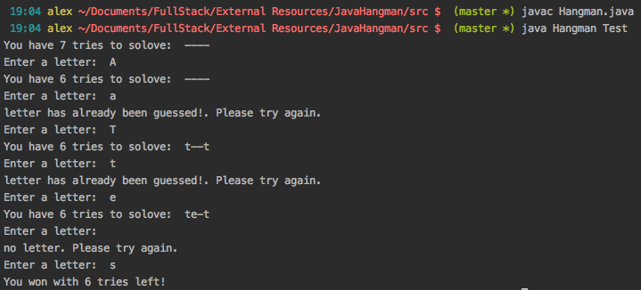

# Hangman - Java OOP

 

## Description

This is a terminal hangman game. User is given seven guesses to come up with the word they provide
as an argument when they run the game.

 

## Run Instructions

The first terminal command compiles the game, then the second command starts the game.
The user types one guess at a time as prompted in the terminal:

The Hangman progress is displayed after each guess. A few examples of input validation
are included in the demo above. 

## This App Utilizes

   * [Java](https://www.oracle.com/technetwork/java/javase/downloads/index.html)

 

## Role in Development

My name is Alex I am a bootcamp graduate whose portfolio can be found
[here]( https://alexsamalot19.github.io/Samalot-Alexander-Portfolio/).
I developed this application using Java as practice with Object Oriented Programming.
